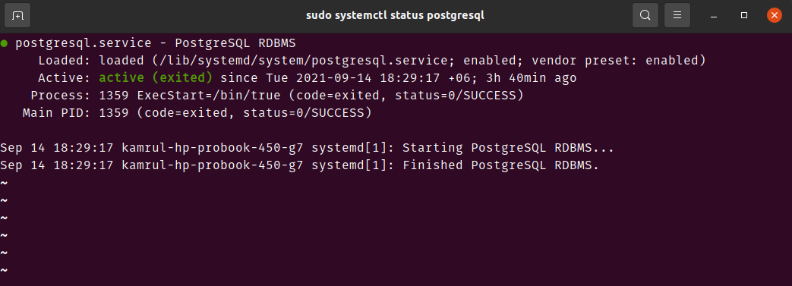
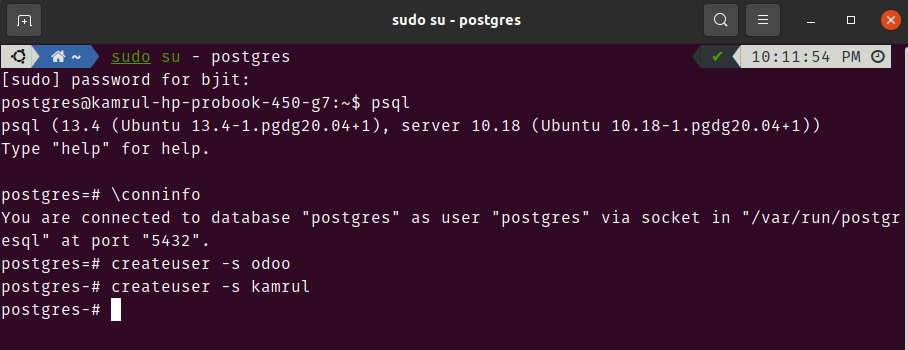
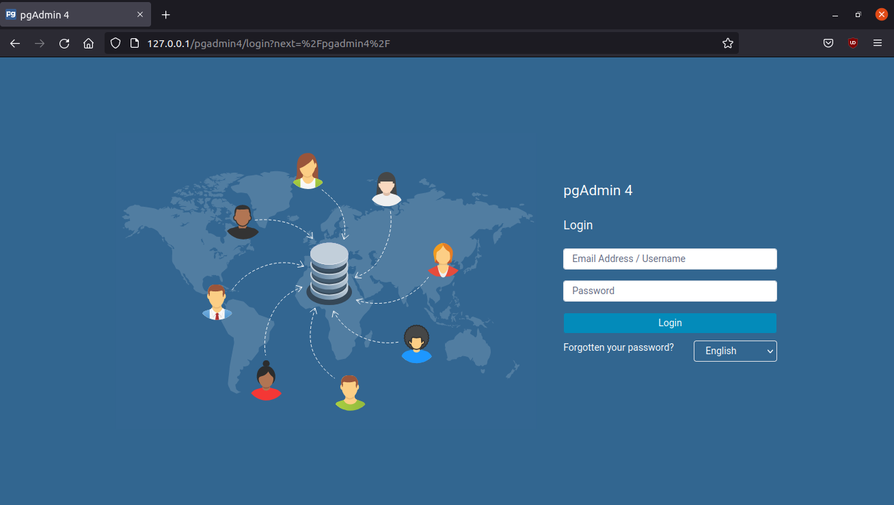
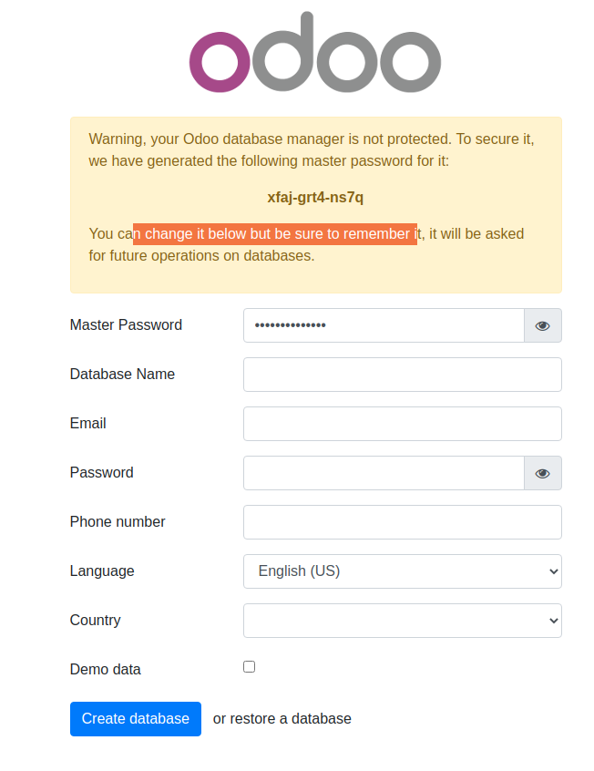
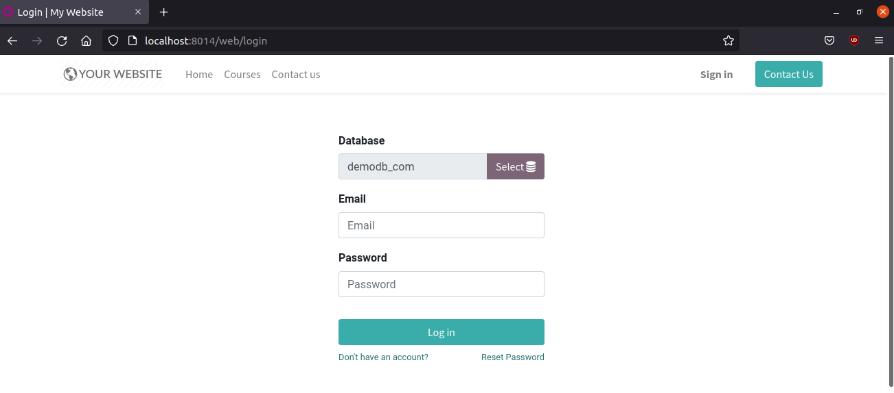
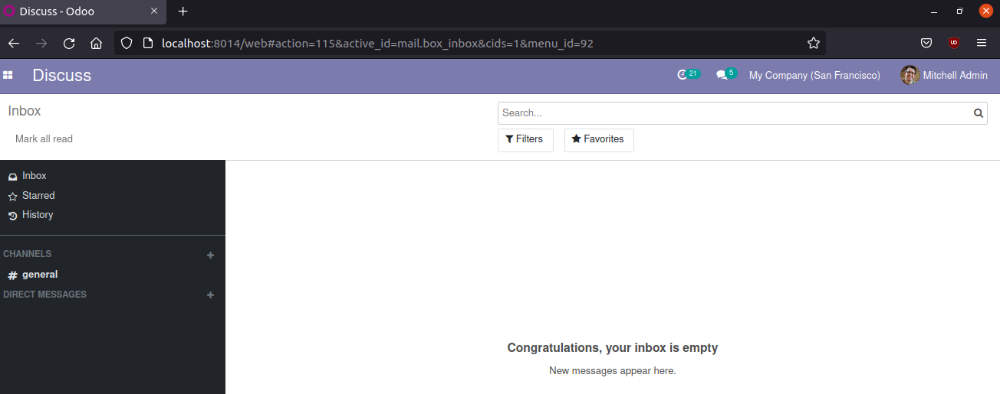
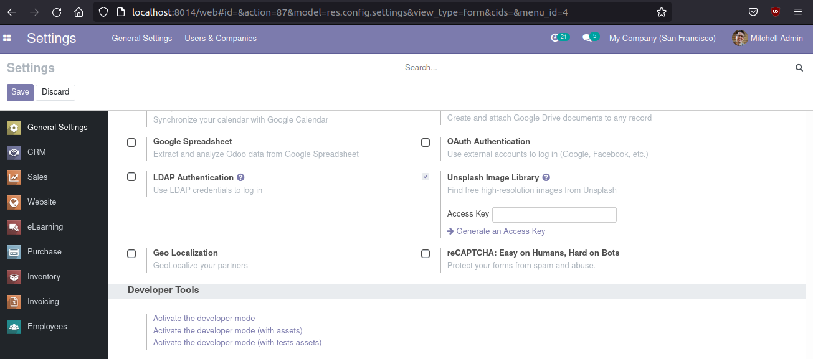
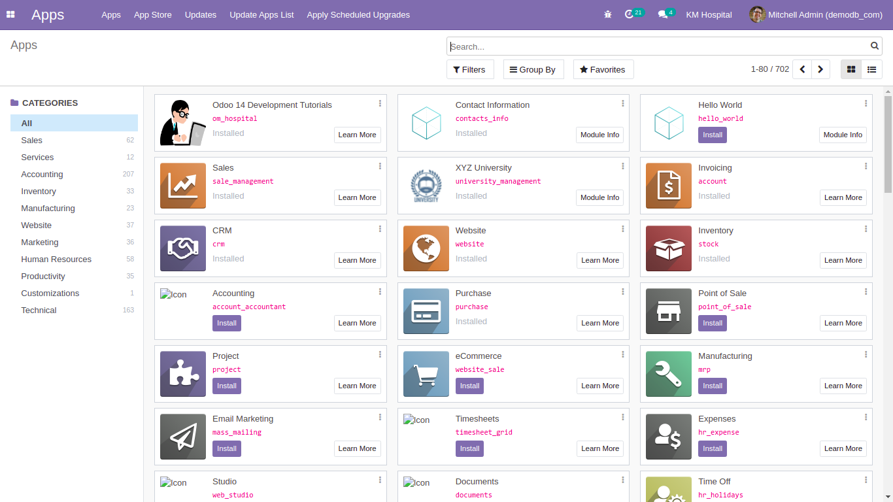

## Installation and environment setup in ubuntu 20.04:

### Install dependencies

- Update, Upgrade & Prerequisites:

  ```sh
  sudo apt-get update
  sudo apt-get -y upgrade
  sudo apt install curl ca-certificates
  ```

- Create Odoo user and group:

  ```sh
  sudo adduser --system --home=/opt/odoo --group odoo
  ```

- Install Ubuntu dependencies:

  ```sh
  sudo apt install git python3-pip build-essential wget python3-dev python3-venv python3-wheel libxslt-dev libzip-dev libldap2-dev libsasl2-dev python3-setuptools node-less python3-psycopg2
  ```

- Install Python dependencies:

  ```sh
  sudo -H pip3 install -r https://raw.githubusercontent.com/odoo/odoo/master/requirements.txt
  ```

- Python Web Dependencies:

  ```sh
  sudo apt-get install -y npm
  sudo ln -s /usr/bin/nodejs /usr/bin/node
  sudo npm install -g less less-plugin-clean-css
  sudo apt-get install node-less
  sudo python3 -m pip install libsass
  ```

### Install PostgreSQL

- Add PostgreSQL GPG key & repository:

  ```sh
  # Install
  sudo apt-get install software-properties-common
  sudo apt-get install python3-software-properties

  # Add GPG Key:
  wget -q https://www.postgresql.org/media/keys/ACCC4CF8.asc -O- | sudo apt-key add -

  # Create a PPA file for PostgreSQL
  sudo sh -c 'echo "deb http://apt.postgresql.org/pub/repos/apt/ focal-pgdg main" >> /etc/apt/sources.list.d/pgdg.list'

  # Install the latest PostgreSQL server
  sudo apt update
  sudo apt-get install postgresql postgresql-contrib
  # Press ‘y’ for any confirmation prompted

  # Verify the service status:
  sudo systemctl status postgresql
  ```

  

- Secure PostgreSQL default Database

  ```sh
  # Login to PostgreSQL shell:
  sudo -u postgres psql

  # set root user credentials
  ALTER USER postgres PASSWORD 'any_password';
  ```

  

### Odoo user setup

- Create Database user for Odoo:

  ```sh
  createuser -s odoo
  createuser -s pc_user_name	# give pc user name not ubuntu_user_name
  \q    # exit
  ```

  

### Odoo14 download and configure

- Permanent permission to read & write:

  ```sh
  sudo chown -R $USER:$USER /opt/odoo
  ```

- Clone odoo from git to the location `/opt/odoo`:

  ```sh
  cd /opt/odoo

  git clone https://www.github.com/odoo/odoo --depth 1 --branch 14.0 --single-branch
  # change the folder name from odoo to odoo14
  # /opt/odoo/odoo14
  ```

- Create Odoo Log file:

  ```sh
  sudo mkdir /var/log/odoo
  sudo chown -R odoo:root /var/log/odoo
  ```

- Edit Odoo configuration file:

  ```sh
  sudo cp /opt/odoo/odoo14/debian/odoo.conf /etc/odoo.conf
  sudo chown odoo: /etc/odoo.conf
  sudo nano /etc/odoo.conf
  ```

- Copy and paste below content in config file:

  ```sh
  # clear config file and copy and paste the below text

  [options]
  ; This is the password that allows database operations:
  ; admin_passwd = PASSWORD
  db_host = False
  db_port = False
  db_user = odoo
  db_password = False
  addons_path = /opt/odoo/odoo14/addons
  ;Log Settings
  logfile = /var/log/odoo/odoo.log
  log_level = error
  ```

### Setup pgAdmin4

- Install pgAdmin4:

  ```sh
  # import the repository signing GPG key and add the pgAdmin4 PPA to your system
  curl https://www.pgadmin.org/static/packages_pgadmin_org.pub | sudo apt-key add -

  sudo sh -c 'echo "deb https://ftp.postgresql.org/pub/pgadmin/pgadmin4/apt/focal pgadmin4 main" > /etc/apt/sources.list.d/pgadmin4.list'

  sudo apt update
  sudo apt install pgadmin4

  # configure pgadmin4
  sudo /usr/pgadmin4/bin/setup-web.sh

  # Press ‘y’ for any confirmation prompted
  # Go to: http://127.0.0.1/pgadmin4
  # Set email and password and you are good to go for web version
  ```

  

### Setup Wkhtmltopdf

- Install Wkhtmltopdf:

  ```sh
  sudo wget https://github.com/wkhtmltopdf/packaging/releases/download/0.12.6-1/wkhtmltox_0.12.6-1.bionic_amd64.deb
  sudo dpkg -i wkhtmltox_0.12.6-1.bionic_amd64.deb
  sudo apt-get install -f
  sudo ln -s /usr/local/bin/wkhtmltopdf /usr/bin
  sudo ln -s /usr/local/bin/wkhtmltoimage /usr/bin
  ```

### Run odoo14 using addons

- Run Odoo 14 using command:

  ```sh
  # For default odoo addons
  /opt/odoo/odoo14/./odoo-bin --addons-path=/opt/odoo/odoo14/addons --xmlrpc-port=8014
  ```

  

### Run odoo14 using both addons and custom_addons

- You can omit this step if you don't work with your own modules
- For working with custom modules create `custom_addons` folder in `/opt/odoo/odoo14` and keep all your custom modules that in folder

  

  ```sh
  /opt/odoo/odoo14/./odoo-bin --addons-path=/opt/odoo/odoo14/addons,/opt/odoo/odoo14/custom_addons --xmlrpc-port=8014
  ```

  

### Create a new database

- Create new database from database selector:

  ```sh
  http://localhost:8014/web/database/selector
  ```

- Store the `master password` in a safe place. This is required for creating a new database. For now create a database (ex. `demodb_com`) and fill the form information. Use `admin` for both email and password. And don't forget to check mark `Demo data` (for testing purpose).

  

- After creating the database you will get this window with the existing databases.

  

- Here you can delete or create a new database.

  

- Click the database to enter and a login window will show to enter the database. You have to put `email` and `password` to login.

  

- After successful login you will see the odoo app page.

  

- You have to activate developer mode to get full access the odoo apps. Just click the `icon` close to discuss > Settings > Activate Developer Mode.

  

- You can see all the odoo apps list in the `Apps` menu.

  

### \* For odoo error:

- Kill odoo process if you face any error running odoo.

  ```sh
  pkill -f odoo
  ```

## 🚀 Happy Coding ! 🔥
