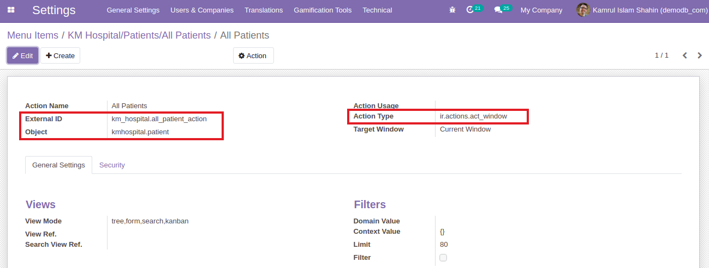
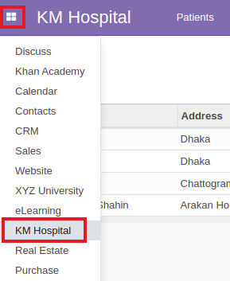
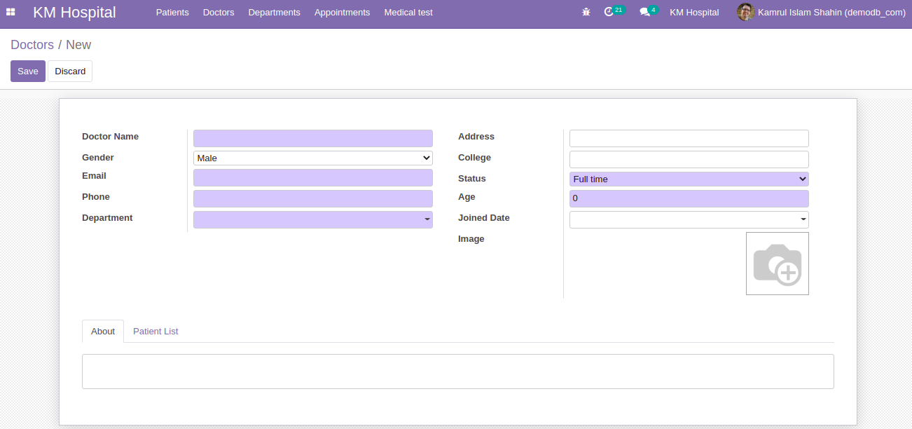
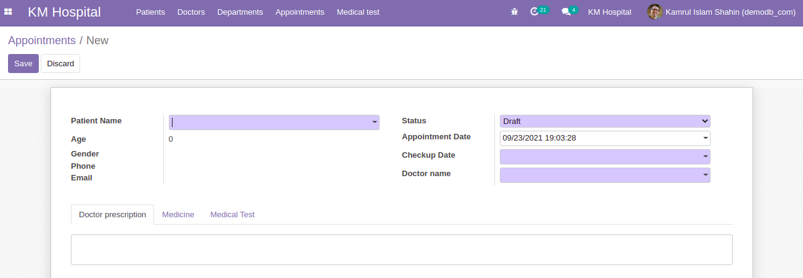

## Creating menus

- Create a directory named `views` in the module and create a file named `patient_view.xml`. Add the `xml` file path in the `__manifest__.py`.
  ```py
  'data': [
        'security/ir.model.access.csv',
        'views/patient_view.xml',
  ]
  ```
  - [Check the `__manifest__.py` file](https://github.com/KamrulSh/km_hospital/blob/main/__manifest__.py#L26-L29)
- Add the basic block in the `patient_view.xml` file:

  ```xml
  <?xml version="1.0" encoding="utf-8"?>
  <odoo>

  </odoo>
  ```

  All the code will be placed inside the `odoo` tag.

- Add below code to create root menu and a menu:

  ```xml
  <!-- for root menu -->
  <menuitem id="hospital_root"
      name="KM Hospital" />
  <!-- for Patients menu -->
  <menuitem id="hospital_patient"
      name="Patients"
      parent="hospital_root"
      action="patient_action" />
  ```

  Check the menuitem if it has been created or not. Go to `Settings > Technical > Menu items`

  

  Search the menuitem name in the search bar and you find it.

  

### Creating Window action

- Add below code to create an action. This action will trigger when `Patients` menu is clicked. We have to set the action id `patient_action` in the menuitem. And `res_model` name should be the same as the model name.

  ```xml
  <record id="patient_action" model="ir.actions.act_window">
      <field name="name">Patients</field>
      <field name="type">ir.actions.act_window</field>
      <field name="res_model">kmhospital.patient</field>
      <field name="view_mode">tree,form,search,kanban</field>
      <field name="help" type="html">
          <p class="o_view_nocontent_smiling_face">
              Create Patients List
          </p>
      </field>
  </record>
  ```

  When we click the menuitem showed in the previous picture it will show the `Action` that we have created already.

  

  And it will show all the information related to that action.

  

  Restart the server and upgrade the module and it will show the module in the App menu. If we don't add the access rights that have done in [previous page](3_security.md) it will not show any menu and as well as our module.

  

## Creating tree views

- Add below code to create tree view. The field name is the same as the name of models field that we have created earlier. It displays records in a tabular form.

  ```xml
  <record id="patient_tree" model="ir.ui.view">
      <field name="name">kmhospital.patient.tree</field>
      <field name="model">kmhospital.patient</field>
      <field name="arch" type="xml">
          <tree>
              <field name="name"/>
              <field name="address"/>
              <field name="gender"/>
              <field name="phone"/>
              <field name="email"/>
              <field name="age"/>
          </tree>
      </field>
  </record>
  ```

  It will show the list of records that have in the database. You can also create new patient information by using `Create` button and it will redirect to the form views.

  

## Creating form views

- Add below code to create form view. It will show a form to create and edit single records.

  ```xml
  <record id="patient_form" model="ir.ui.view">
      <field name="name">kmhospital.patient.form</field>
      <field name="model">kmhospital.patient</field>
      <field name="arch" type="xml">
          <form>
              <sheet>
                  <group>
                      <group>
                          <field name="name"/>
                          <field name="address"/>
                          <field name="phone"/>
                      </group>
                      <group>
                          <field name="gender"/>
                          <field name="email"/>
                          <field name="age"/>
                      </group>
                  </group>
                  <notebook>
                      <page string="Appointments">
                      </page>
                  </notebook>
              </sheet>
          </form>
      </field>
  </record>
  ```

  Here some fields are required such as `Patient Name, Phone, Age` mentioned as deep color. Other fields are optional.

  

## Creating search views

- Add below code to create search view. It will lookup for patient information based on search criteria.

  ```xml
  <record id="patient_search" model="ir.ui.view">
      <field name="name">kmhospital.patient.search</field>
      <field name="model">kmhospital.patient</field>
      <field name="arch" type="xml">
          <search string="Patients">
              <field name="name"/>
              <field name="gender"/>
              <field name="phone"/>
              <field name="age"/>
          </search>
      </field>
  </record>
  ```

  

## Creating kanban views

- Add below code to create kanban view. It is an advanced view to display the records as cards.

  ```xml
  <record id="patient_kanban" model="ir.ui.view">
    <field name="name">kmhospital.patient.kanban</field>
    <field name="model">kmhospital.patient</field>
    <field name="arch" type="xml">
        <kanban default_group_by="gender">
            <field name="name"/>
            <field name="gender"/>
            <field name="phone"/>
            <field name="email"/>
            <templates>
                <t t-name="kanban-box">
                    <div class="oe_kanban_global_click">
                        <div class="oe_kanban_details">
                            <h1 class="o_kanban_record_title"><field name="name"/></h1>
                            <ul>
                                <li>Gender : <field name="gender"/></li>
                                <li>Phone : <field name="phone"/></li>
                                <li>Email : <field name="email"/></li>
                                <li>Age : <field name="age"/></li>
                            </ul>
                        </div>
                    </div>
                </t>
            </templates>
        </kanban>
    </field>
  </record>
  ```

  It will create a kanban view based on the gender `male and female`.

  

- [Lookup all the code for `patient_view.xml`](https://github.com/KamrulSh/km_hospital/blob/main/views/patient_view.xml)

### Task:

- Create `Doctor`, `Department`, `Appointments` and `MedicalTest` model, add tree, form and kanban views, create menuitem for each model and perform actions when the menu is clicked based on the picture below.

  
  
  
  

- Go through all the views from [here](https://github.com/KamrulSh/km_hospital/blob/main/views) if you face any problems.

## 🚀 Happy Coding ! 🔥
